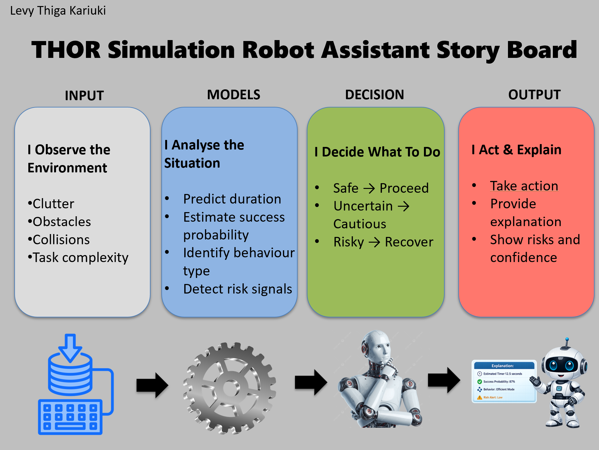

# THOR Robot Decision System 🤖

## Overview

This project implements an integrated AI decision system for a simulated robot environment (THOR). The system predicts task duration, estimates success probability, identifies behavioural patterns, and detects risk conditions, combining these signals into a unified decision-making pipeline.

The goal is to enable the robot to adapt between normal execution and recovery behaviour in a transparent and safety-aware manner.

---

## Key Features

- Multi-model AI pipeline (regression, classification, clustering, anomaly detection)
- Task duration prediction using regression models
- Task success estimation using classification models
- Behavioural pattern identification through clustering
- Rule-based anomaly detection for risk identification
- Decision policy layer for action selection (proceed / cautious / recover)
- Interpretable explanation outputs for each decision
- Optional LLM-based explanation generation (experimented with constrained outputs)

---

## System Pipeline

The system follows a structured decision pipeline:

1. **Input Processing**
   - Environment features (e.g. clutter, obstacles, collisions, interaction complexity)

2. **Model Outputs**
   - Regression → predicts task duration  
   - Classification → estimates success probability  
   - Clustering → identifies behavioural archetype  
   - Rules & Anomalies → detects high-risk conditions  

3. **Decision Policy**
   - Combines all signals to determine the appropriate action:
     - Proceed
     - Proceed cautiously
     - Recover and replan

4. **Output**
   - Final action  
   - Explanation including duration, success probability, behaviour type, and risk signals  

---

## System Diagram

The system integrates multiple models into a unified decision pipeline, combining predictive outputs with rule-based logic to determine safe and adaptive robot behaviour.

---

## Example Behaviour

- **Success Case**
  - High success probability  
  - Low-risk signals  
  - → Robot proceeds normally  

- **Recovery Case**
  - Low success probability  
  - High collision / clutter signals  
  - → Robot switches to recovery behaviour  

---
## Results
### Task 1: Regression Performance (Task Duration Prediction)

The regression model estimates how long a task will take to complete.

- **R² Score:** ~0.88  
- **Mean Absolute Error (MAE):** ~0.29  
- **Root Mean Squared Error (RMSE):** ~0.41  

Random Forest Regression was selected due to its ability to capture non-linear relationships between environmental features and task duration, providing accurate and robust predictions.

### Task 2: Classification Performance (Success Prediction)

The classification model predicts whether a task will succeed or fail based on environmental and interaction features.

| Model                     | Accuracy | Precision | Recall | F1 Score | ROC-AUC |
|--------------------------|----------|-----------|--------|----------|---------|
| Logistic Regression      | 0.72     | 0.64      | 0.65   | 0.65     | 0.79    |
| Random Forest Classifier | 0.69     | 0.61      | 0.62   | 0.61     | 0.78    |

Logistic Regression was selected as the final model due to its stronger overall performance and more stable probability estimates, which are important for decision-making under uncertainty.

### Confusion Matrix

---

### Key Insight

Task duration is primarily influenced by movement efficiency and environmental complexity, while task success is driven by interaction difficulty and high-friction conditions. 

Combining these signals allows the system to make more robust and risk-aware decisions than using any single model in isolation.

---

## Design Considerations

### Safety
The system prioritises safety by detecting high-risk conditions (e.g. collisions, high clutter) and triggering recovery behaviour instead of continuing unsafe execution.

### Misclassification Costs
Overestimating success is treated as more critical than acting conservatively. The decision threshold is adjusted to increase sensitivity to risk.

### Transparency
Each decision includes a structured explanation showing key signals, improving interpretability and trust.

### Accessibility
The system operates on structured inputs and does not rely on voice interaction, making it suitable for different interfaces.

---

## Limitations

- Trained on synthetic data, which may limit real-world generalisation  
- Rule-based decision policy may not capture more complex adaptive behaviours  
- LLM explanations require constraints to avoid hallucinated outputs  

---

## Tech Stack

- Python  
- scikit-learn  
- pandas  
- numpy  
- matplotlib  
- TinyLlama-1.1B-Chat-v1.0 transformer (for LLM experiments) ⚙️

---

## Project Structure
thor-robot-decision-system/
│
├── data/
├── images/
├── notebook/
│   └── thor-robot-decision-system.ipynb
├── outputs/
├── LICENSE
├── README.md
├── requirements.txt

---

## Future Improvements

- Integrate real-world robotic datasets  
- Replace rule-based policy with reinforcement learning  
- Improve adaptive decision-making under uncertainty  
- Enhance explanation generation with grounded LLM techniques  

---

## Summary

This project demonstrates how multiple machine learning models can be integrated into a coherent decision-making system. By combining predictive models with behavioural insights and explanation mechanisms, the system provides a robust and interpretable framework for robot decision-making in complex environments.
